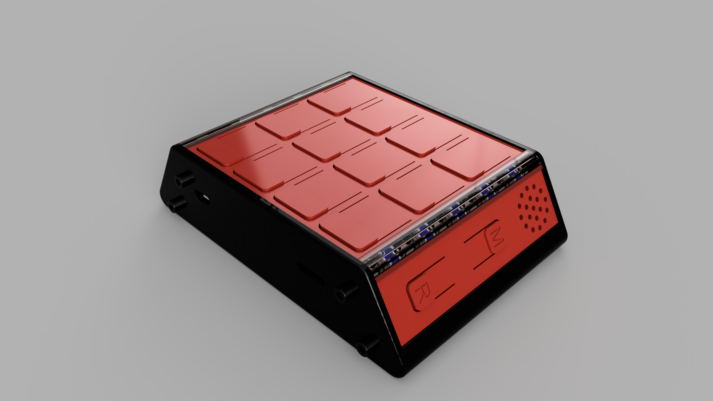
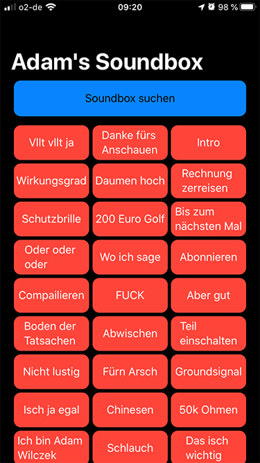
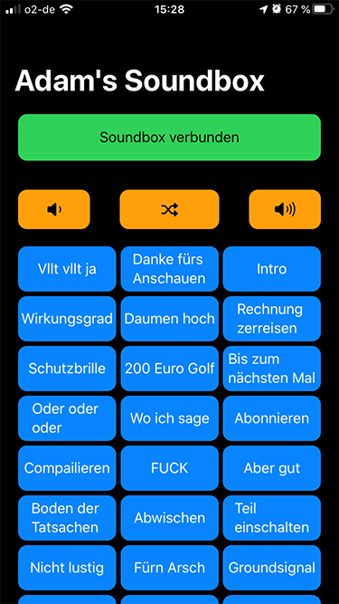

# Soundbox

Dieses Projekt beinhaltet die Arduino Firmware, die iOS-App, die Ordnerstruktur für das Soundmodul, die CAD-Zeichnungen und die .stl-Files für die druckbaren Teile der Soundbox. 

Die Soundbox funktioniert wie folgt: Beim Einschalten wird das Soundfile 001.mp3 (variabel) aus dem Verzeichnis 01 abgespielt.
Anschließend wird ein silence-Audiofile [1] (Verzeichnis 02) in der Dauerschleife abgespielt. 
Das ist notwendig, da die Drücker mit den Audiofiles aus dem ADVERT Verzeichnis verlinkt sind und diese nur 
ausgeführt werden können, wenn bereits eine Audiodatei abgespielt wird.

Jedem Drücker kann nun Audiofile aus dem Verzeichnis ADVERT zugeordnet werden, mit der MODE (M) Taste kann
zwischen den drei Belegungslayern durchgeschaltet werden. Beim Drücken der RADIO (R) Taste werden die 
Audiofiles im MP3-Verzeichnis geshuffelt. Bei wiederholtem drücken wird ein neuer Song gestartet. 
Die Dateien im MP3-Verzeichnis müssen durchnummeriert werden (0001-9999), beachte die führenden Nullen,
es ergibt sich immer eine Zahl aus vier Ziffern. Das beigelegte rename.py file kann eure Songs automatisch umbenennen.

Die iOS-App ist eine Soundbox To-Go. Sie umfasst die selben Funktionen wie die Hardwarebox und ist in der Lage
sich mit der Soundbox via BLE zu koppeln. In diesem Modus dient die App als Remote Control für die Soundbox.

Wenn ihr eure eigene Soundbox bauen möchtet, müsst ihr folgende Schritte durchführen:

1. Klont euch das Projekt, oder downloaded es als .zip File.
2. Ladet euch die adambox.ino auf euren Arduino Nano (es müssen noch die entsprechenden Libs installiert werden).
3. Druckt euch die .stl-Files aus.
4. Verdrahtet die Hardware nach Schaltplan.
5. Baut die Box nach der CAD-Zeichnung zusammen.
6. Kopiert eure Soundfiles in die entsprechenden Verzeichnisse (siehe SD-Card). Alternativ können auch die Adamfiles genutzt werden.
7. Optional: Kopiert das Xcode Projekt, compiliert es und wählt als Target euer angeschlossenes iOS-Device aus.

App als Soundbox           |  App als remote control
:-------------------------:|:-------------------------:
|  

1 Anar Software LLC, https://github.com/anars/blank-audio
